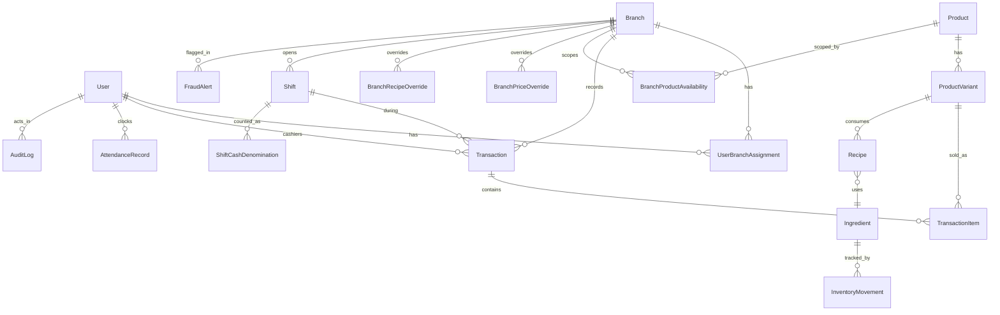

# Potato Corner POS — System Overview

**Generated:** 2026-07-20 · **Commit:** `a272a7d3207bae0a0a498bedcc90fc89c61e6cda` · **Tool:** Claude Code

> ⚠️ **Documentation drift warning:** `.claude/CLAUDE.md` still describes the stack as "BullMQ with Upstash Redis" and "Socket.io with Redis adapter." This is **stale** — Phase 21 fully removed Redis (see [§17](#17-recent-incidents--lessons-learned) and [§16](#16-known-gaps--technical-debt)). Trust this document and the code (`apps/api/src/lib/pg-lock.ts`, `apps/api/src/lib/id-counter.ts`, `apps/api/src/lib/job-runner.ts`) over `CLAUDE.md` on this point.

## Table of Contents
1. [Executive Summary](#1-executive-summary)
2. [Architecture Diagram](#2-architecture-diagram)
3. [Repository Structure](#3-repository-structure)
4. [Tech Stack](#4-tech-stack)
5. [Deployment Infrastructure](#5-deployment-infrastructure)
6. [Data Model](#6-data-model)
7. [Authentication & Authorization](#7-authentication--authorization)
8. [Backend API](#8-backend-api)
9. [Frontend Application](#9-frontend-application)
10. [Real-time Layer](#10-real-time-layer-socketio)
11. [Business Logic Domains](#11-business-logic-domains)
12. [Environment Variables Reference](#12-environment-variables-reference)
13. [Local Development Setup](#13-local-development-setup)
14. [Testing Strategy](#14-testing-strategy)
15. [Operational Runbooks](#15-operational-runbooks)
16. [Known Gaps & Technical Debt](#16-known-gaps--technical-debt)
17. [Recent Incidents & Lessons Learned](#17-recent-incidents--lessons-learned)
18. [Roadmap](#18-roadmap)
19. [Team & Ownership](#19-team--ownership)
20. [Glossary](#20-glossary)

---

## 1. Executive Summary

Potato Corner POS is a unified web application serving three role-based interfaces (Super Admin, Supervisor, Staff POS) for a multi-branch Philippine QSR franchise, from a single Next.js + Express monorepo. Core design constraints (locked in `docs/architecture/final-approved-architecture.md`): one web app, no separate mobile app, offline-first POS terminal, recipe-driven inventory deduction, denomination-level cash reconciliation, an immutable hash-chained audit trail, and PH tax compliance (PWD/Senior Citizen VAT, BIR receipts) built into the transaction engine.

**Deployment stack:** Vercel (Next.js frontend) → Render (Express API, Docker) → Supabase (PostgreSQL, Sydney region) + Supabase Storage. Redis/Upstash and BullMQ were fully removed in Phase 21 in favor of Postgres-native locking, ID generation, and in-process job scheduling.

**Current phase position:** roadmap is 20 phases (`docs/architecture/master-execution-plan.md`) plus several unplanned change requests (CR-001 product catalog/branch overrides, Phase 20.5 refresh-token race fix, Phase 21 Redis eradication, Phase 21.5 rotation-cache restoration). `PROJECT_STATUS.md`'s own tracked history runs through **Phase 20 / "Session F"** (2026-07-19); the most recent work per project memory extends into **Phase 21.5** (2026-07-19/20), which is **not yet reflected in `PROJECT_STATUS.md` or `CLAUDE.md`** — treat both as lagging the live repo.

**Key metrics (measured directly from repo, 2026-07-20):**

| Metric | Value |
|---|---|
| Backend (`apps/api/src`) LOC | ~29,100 |
| Frontend (`apps/web/{app,components,hooks,stores,lib}`) LOC | ~24,200 |
| Backend modules | 18 (`apps/api/src/modules/*`) |
| Prisma models | 32 |
| Applied migrations | 19 |
| Backend test files | 64 |
| Frontend test files | 28 |
| Playwright E2E spec files | 11 |
| Frontend pages (`page.tsx`) | 51 |

---

## 2. Architecture Diagram

```
┌────────────┐      HTTPS       ┌──────────────────┐      HTTPS/WS      ┌───────────────────┐      TCP (pooled)      ┌──────────────────┐
│  Browser   │ ───────────────▶ │  Vercel           │ ──────────────────▶│  Render            │ ───────────────────────▶│  Supabase          │
│ (Next.js   │ ◀─────────────── │  Next.js 15       │ ◀──────────────────│  Express 5 API     │ ◀───────────────────────│  Postgres + Storage│
│  SSR/CSR)  │   httpOnly       │  App Router (SSR)  │   REST + Socket.io │  (Docker container) │   Prisma (pgbouncer)   │  (Sydney)           │
└────────────┘   JWT cookies    └──────────────────┘                     └───────────────────┘                          └──────────────────┘
      │                                                                          │
      │  Service Worker (@ducanh2912/next-pwa)                                  │  In-process daily scheduler
      │  + Dexie/IndexedDB offline cart & sync queue                            │  (lib/daily-scheduler.ts) — EOD summary,
      ▼                                                                          │  fraud sweep, report pre-compute
  Offline-first POS terminal                                                     ▼
                                                                            Postgres-backed:
                                                                            - advisory locks (lib/pg-lock.ts)
                                                                            - ID counters (lib/id-counter.ts)
                                                                            - job retry/backoff (lib/job-runner.ts)
                                                                            (replaces Redis/BullMQ, removed Phase 21)
```

**Auth flow:** login issues an RS256-signed access JWT (15 min TTL) + opaque refresh token (7 day TTL, SHA-256 hashed at rest) as httpOnly cookies. Refresh rotation uses a Postgres advisory lock (`pg-lock.ts`) plus a rotation-result cache (`RefreshTokenRotationCache` model, Phase 21.5) to coalesce concurrent refresh calls and survive the race that Phase 20.5 first patched with a grace window. Cross-tab logout uses `BroadcastChannel` (`apps/web/lib/auth-broadcast.ts`).

**Real-time layer:** Socket.io server (`apps/api/src/socket/socket.server.ts`) authenticates the handshake via the same JWT-verification helper the HTTP layer uses (`lib/verify-access-token.ts`), then joins each socket to a per-branch room and a per-user room (`socket/rooms.ts`). Single in-memory adapter — no Redis adapter, so it does not horizontally scale past one Render instance (see [§10](#10-real-time-layer-socketio)).

---

## 3. Repository Structure

Actual repo root is **nested one level** below the folder named on disk: `.../potato-corner-web-pos-main-main/potato-corner-web-pos-main-main/` (the outer folder is just the extracted zip wrapper). All paths below are relative to that inner root.

```
├── apps/
│   ├── api/            Express 5 backend — modular monolith, Prisma ORM, Socket.io server
│   └── web/             Next.js 15 App Router frontend — 3 role-scoped route groups + auth
├── packages/
│   ├── config/          Shared eslint/prettier/tsconfig presets consumed via workspace:*
│   └── shared/           Cross-app types, Zod schemas, constants (incl. SOCKET_EVENTS)
├── docs/
│   ├── architecture/     Locked spec docs (final-approved-architecture.md, master-execution-plan.md)
│   ├── audits/            Point-in-time frontend/security audits
│   ├── decisions/          Architecture Decision Records (currently just a README pointer)
│   ├── runbooks/           Backup/restore, pilot on-call, feedback template
│   ├── security/           Phase 19 security/PWA hardening audits
│   └── superpowers/plans/  Dated implementation plans per phase
├── tests/e2e/            Playwright specs (11 files)
├── audit-*.md            Root-level dated audit reports (auth, catalog, delete-nav, product-completeness)
├── PROJECT_STATUS.md      Living status report — large, incrementally updated, see drift warning above
├── .github/workflows/    ci.yml, deploy-staging.yml, deploy-production.yml
├── pnpm-workspace.yaml   Workspace roots: apps/*, packages/*
└── turbo.json            Turborepo pipeline (build/dev/lint/type-check/test)
```

---

## 4. Tech Stack

| Layer | Technology | Version (from package.json) | Purpose |
|---|---|---|---|
| Monorepo | pnpm workspaces + Turborepo | pnpm `11.10.0`, Turborepo `^2.10.4` | Shared installs, cached/parallel task pipeline |
| Frontend framework | Next.js (App Router) | `15.5.20` | SSR/CSR, role-scoped route groups |
| UI runtime | React | `19.1.0` | Shared across web + api (api uses React only for `@react-pdf/renderer`) |
| Language | TypeScript (strict) | `^5.7.3` | Both apps |
| Styling | Tailwind CSS | `^3.4.19` | Frontend |
| Components | shadcn/ui (Radix primitives) | Radix packages `^1.x`/`^2.x` | Frontend UI kit |
| Backend framework | Express | `^5.0.1` | Modular monolith API |
| ORM | Prisma | `^5.22.0` | Postgres access, migrations |
| Database | PostgreSQL | via Supabase Pro | Primary datastore |
| Validation | Zod | `^4.0.0` | Every API payload + env schema, both apps |
| Auth | `jsonwebtoken` | `^9.0.2` | RS256 access tokens |
| Real-time | Socket.io / socket.io-client | `^4.8.1` | Live dashboards, POS event feed |
| Client state | Zustand | `^5.0.2` | Browser-only state (cart, shift, auth cache, socket, UI) |
| Server state | TanStack Query | `^5.62.11` | All DB-backed data on the frontend |
| Offline storage | Dexie.js | `^4.0.10` | IndexedDB wrapper for offline cart/sync queue |
| PWA | `@ducanh2912/next-pwa` | `^10.2.9` | Service worker, installability |
| Unit/integration tests | Vitest | `^3.0.2` (both apps) | `apps/api`: 64 files; `apps/web`: 28 files |
| E2E tests | Playwright | `^1.49.1` | 11 specs under `tests/e2e/` |
| PDF generation | `@react-pdf/renderer` | `^4.1.6` | Receipts, reports (both apps) |
| Error tracking | `@sentry/node` | `^8.47.0` | Backend only — `@sentry/nextjs` recommended but not yet installed on frontend |
| Email | Resend | `^4.0.1` | Password reset, notifications |
| Image processing | `sharp` | `^0.35.3` | Backend |

---

## 5. Deployment Infrastructure

| Environment | Platform | Purpose | Status |
|---|---|---|---|
| Production | Vercel (web) + Render (api, Docker) + Supabase Sydney (db) | Live pilot | Frontend confirmed live; backend Render service confirmed provisioned (per Session F closeout in memory) |
| Staging | — | Pre-prod verification | **Not provisioned** — GitHub Environment "staging" doesn't exist; `RENDER_DEPLOY_HOOK_STAGING`/`STAGING_DATABASE_URL` unset. `deploy-staging.yml` exists but its deploy steps will silently skip. |
| Local dev | Node.js + local/remote Supabase | Development | See [§13](#13-local-development-setup) |

**CI/CD** (`.github/workflows/`):
- `ci.yml`: on push — `pnpm install --frozen-lockfile` → `prisma generate` → `prisma migrate deploy` → `type-check` → `lint` → `test` → `build`.
- `deploy-production.yml`: gated on GitHub Environment `production`; posts to `RENDER_DEPLOY_HOOK_PRODUCTION` if the secret is set. **Known gap:** the workflow's own comment (line ~53-54) claims manual-approval protection is enforced, but this was fixed in Session F — a required reviewer was added to the `production` environment (per project memory); re-verify this is still configured before trusting it blindly.
- `deploy-staging.yml`: same shape, targets unprovisioned staging environment — currently a no-op in practice.
- A stray auto-created GitHub environment `potato-corner-api / production` (created 2026-07-17 by Render's GitHub App) exists with unclear purpose — flagged as a likely deletion candidate pending verification of Render's GitHub App integration.

---

## 6. Data Model

32 Prisma models (`apps/api/prisma/schema.prisma`, 1046 lines, 19 applied migrations), grouped by domain:

**Auth:** `User`, `Branch`, `UserBranchAssignment`, `RefreshToken`, `RevokedToken`, `PasswordResetToken`, `RefreshTokenRotationCache` (Phase 21.5), `PinCredential`

**Products:** `Product`, `ProductVariant`, `Flavor`, `ProductVariantFlavor`, `BranchProductAvailability`, `BranchFlavorAvailability`, `BranchPriceOverride`, `ProductRequest` (CR-001)

**Inventory/Recipes:** `Ingredient`, `Recipe`, `BranchRecipeOverride`, `InventoryMovement`

**Orders/Cash:** `Transaction`, `TransactionItem`, `Shift`, `HoldOrder`, `HoldOrderItem`, `ShiftCashDenomination`

**System:** `IdCounter` (Phase 21 Redis-INCR replacement), `AttendanceRecord`, `AuditLog`, `FraudAlert`, `ReportSnapshot`, `Notification`

For full field-level detail and cascade rules, read `apps/api/prisma/schema.prisma` directly or `docs/architecture/database-schema.md` — the latter is flagged stale in `PROJECT_STATUS.md` §19 (still describes a pre-CR-001 model list) and should be spot-checked against the schema before trusting it.



**Known data-model debt (per `PROJECT_STATUS.md` §16, not re-verified this pass):** `AuditLog.createdAt` unindexed despite being the hash-chain sort key; `RefreshToken` missing composite `[userId, revokedAt]` index; `TransactionItem.productId` lacks an enforced FK relation; `Recipe` allows duplicate `(productVariantId, ingredientId, flavorId)` rows while its override table doesn't.

---

## 7. Authentication & Authorization

- **JWT strategy:** RS256 access token (15 min default TTL, `JWT_ACCESS_TOKEN_TTL`) signed with `JWT_PRIVATE_KEY`/verified with `JWT_PUBLIC_KEY`; opaque refresh token (7 day default, `JWT_REFRESH_TOKEN_TTL`) stored SHA-256-hashed in `RefreshToken`, secret-keyed via `JWT_REFRESH_SECRET` (min 32 chars, enforced by Zod at boot).
- **Token storage:** httpOnly cookies (not localStorage) — set/read by `apps/api/src/modules/auth` and consumed by `apps/web/middleware.ts`.
- **Refresh rotation:** Postgres advisory lock (`apps/api/src/lib/pg-lock.ts`) serializes concurrent refresh attempts for the same token; `RefreshTokenRotationCache` (Phase 21.5) short-circuits duplicate refresh calls that land inside the lock window so retried offline-sync/tab-restore requests don't all re-rotate. This replaced a simpler "30s grace window" approach originally specified in the Phase 20.5 brief — the grace-window design was rejected in favor of lock+cache coalescing (see project memory `project_potato_corner_phase20_5_refresh_race`).
- **Cross-tab logout sync:** `BroadcastChannel` (`apps/web/lib/auth-broadcast.ts`) — one tab logging out (or detecting a revoked/expired session) broadcasts to sibling tabs so they clear local auth state without a stale UI persisting.
- **Role hierarchy:** `super_admin` → `admin` → `supervisor` → `staff` (exact role strings live in `packages/shared`; JWT payload shape is documented per-role in `.claude/CLAUDE.md` and is a locked contract — do not modify without an explicit change request).
- **Middleware chain:**
  - Frontend: `apps/web/middleware.ts` (236 lines) — role-based route gating across `(admin)`, `(supervisor)`, `(pos)`, `(auth)` route groups.
  - Backend: `authenticate.ts` (JWT verify) → `authorize.ts` (role check, exposes `adminOnly`/`adminOrSupervisor` helpers) → `branch-guard.ts` (branch-scoping) → `require-password-change.ts` (forced password-change gate — per `PROJECT_STATUS.md`, applied on only 1 of 9 routers as of the last audit, flagged as inconsistent) → `csrf-guard.ts`.
- **Known past incidents:** see [§17](#17-recent-incidents--lessons-learned) for the Redis removal, PgBouncer prepared-statement fix, and refresh-token race in full.

---

## 8. Backend API

18 modules under `apps/api/src/modules/`, all mounted in `apps/api/src/app.ts`:

| Module | Endpoints (router methods) | Notes |
|---|---|---|
| `auth` | 10 | Login, refresh, logout, password reset/change |
| `branches` | 9 | CRUD + inventory sub-routes (mounted twice: `/api/branches`) |
| `products` | 16 | Largest module — catalog + variants + branch availability + price overrides surface |
| `transactions` | 10 | Cart/checkout/void/refund |
| `employees` | 9 | Staff CRUD, branch assignment |
| `recipes` | 9 | Base + branch-override recipes |
| `inventory` | 13 | Stock-in, adjust, waste, transfer, physical count |
| `cash` | 8 | Shift open/close, denomination counting, variance |
| `flavors` | 6 | Flavor master + variant linkage |
| `fraud` | 6 | Alert list/investigate/dismiss/escalate |
| `reports` | 5 | X-read/Z-read/analytics |
| `attendance` | 5 | Clock-in/out, corrections |
| `product-requests` | 4 | CR-001 branch → HQ product requests |
| `notifications` | 3 | List/mark-read |
| `price-overrides` | 3 | CR-001 branch price overrides |
| `audit` | **0** | **Stub** — router file exists (13 lines) with no routes wired |
| `discounts` | **0** | **Stub** — same shape |
| `receipts` | **0** | **Stub** — same shape (public `/r/[txn]` frontend route has nothing to call) |

Each module follows a fixed 4-file shape: `<name>.router.ts` → `<name>.service.ts` → `<name>.repository.ts` (all Prisma access goes through here — routers never call Prisma directly) → `<name>.types.ts`.

**Cross-cutting middleware** (`apps/api/src/middleware/`): `authenticate`, `authorize`, `branch-guard`, `csrf-guard`, `rate-limiter` (now in-memory via express-rate-limit's default store — Redis-backed store removed Phase 21), `require-password-change`, `audit-log`, `validate` (Zod request validation), `shift-guard` (blocks POS actions outside an open shift).

**Prisma client & PgBouncer:** `apps/api/src/lib/prisma.ts` initializes the client; `apps/api/src/config/index.ts` runs `assertPgBouncerCompatible()` at boot, which throws if `DATABASE_URL` targets the port-6543 transaction pooler without `?pgbouncer=true` in the query string — this guards against the exact prepared-statement failure mode that caused a production incident (see [§17](#17-recent-incidents--lessons-learned)).

**Config schema** (`apps/api/src/config/index.ts`): a single Zod schema validates all of `process.env` at boot and fails fast with field-level errors; see [§12](#12-environment-variables-reference) for the full variable table.

**Queues** (`apps/api/src/queues/`): `inventory`, `fraud`, `eod`, `notification`, `report`, `hold-order` — all now run through `lib/job-runner.ts` (Postgres-backed retry/backoff, preserving the architecture doc's 10s/60s/300s schedule) instead of BullMQ, per Phase 21.

---

## 9. Frontend Application

Route groups under `apps/web/app/` (51 `page.tsx` files total):

| Route group | Purpose | Notes |
|---|---|---|
| `(admin)/admin/*` | Super Admin console | approvals, attendance, audit-logs, branches, dashboard, employees, flavors, fraud-alerts, products, recipes, reports, settings, shifts |
| `(supervisor)/supervisor/*` | Branch supervisor console | approvals, attendance, cash, dashboard, employees, inventory, price-overrides, product-requests, recipes, reports |
| `(pos)/*` | Staff POS terminal | clock-in, receipts, shift open/close, terminal (offline-first) |
| `(auth)/*` | Auth flows | login, change-password, reset-password |
| `r/[txn]` | Public receipt view | frontend route exists; backend `receipts` module is a stub (see §8) — this route currently has no live data source |
| `api/health` | Liveness probe | the **sole** Next.js API route permitted by project rules — all other API logic lives in the Express backend |

**Hooks** (`apps/web/hooks/`): `use-auth`, `use-branch`, `use-cart`, `use-offline`, `use-realtime-invalidate` (bridges socket events into TanStack Query cache invalidation), `use-socket`, plus a `queries/` subfolder for TanStack Query hooks.

**Stores** (`apps/web/stores/`, Zustand — browser-only state per the project's strict DB-state/browser-state separation rule): `auth.store`, `branch.store`, `cart.store`, `shift.store`, `socket.store`, `ui.store`.

**Middleware** (`apps/web/middleware.ts`, 236 lines): role-based routing — redirects unauthenticated/wrong-role requests away from gated route groups.

**API client** (`apps/web/lib/api-client.ts`): centralizes fetch calls; implements refresh-token dedup so concurrent 401s from multiple in-flight requests trigger exactly one refresh call, not one per request.

**Offline** (`apps/web/lib/offline/`): Dexie/IndexedDB-backed cart and sync queue; two TODOs remain open per `PROJECT_STATUS.md` — wiring the sync queue to the online/offline transition and populating the cache from TanStack Query.

**UI library:** shadcn/ui components (Radix primitives) throughout; `@tremor/react` for charts/KPI cards on the dashboards; `recharts` for report visualizations.

---

## 10. Real-time Layer (Socket.io)

- **Server** (`apps/api/src/socket/socket.server.ts`): authenticates the handshake using the same JWT-verification helper as the HTTP layer (`lib/verify-access-token.ts`) — no duplicated auth logic between the two transports. Rejects unauthenticated handshakes (this was previously flagged as a possible spoofing gap in an earlier audit pass; re-verified as a stale finding — the check was already correct).
- **Client** (`apps/web/hooks/use-socket.ts`, `apps/web/stores/socket.store.ts`): connects post-login, feeds `use-realtime-invalidate.ts` to keep TanStack Query caches fresh without polling.
- **Rooms** (`apps/api/src/socket/rooms.ts`): every branch has its own room; Super Admin joins all of them; every socket also joins a room scoped to its own user id (for events like report-export links that must reach only the requester).
- **Events** (`packages/shared/src/constants/events.ts`, `SOCKET_EVENTS`): `transaction:completed`, `transaction:refunded`, `inventory:low_stock`, `inventory:out_of_stock`, `inventory:product_unavailable`, `cash:variance_flagged`, `cash:variance_approved`, `cash:shift_opened`, `cash:shift_closed`, `void:requested`, `void:approved`, `hold_order:expired`, `attendance:clocked_in`, `attendance:clocked_out`, `fraud:alert_created`, `notification:large_adjustment_approval_needed`, `notification:offline_transactions_synced`, `notification:eod_summary`, `fraud:alert_investigated`/`fraud:alert_dismissed` (reserved, not yet emitted — fraud review actions are currently silent by design).
- **Known limitation:** single-instance in-memory Socket.io adapter — no Redis (or other) adapter for cross-instance pub/sub, so this does not horizontally scale past one Render dyno. Acceptable at current pilot scale; would need revisiting before a multi-instance deploy.

---

## 11. Business Logic Domains

| Domain | Status | Notes |
|---|---|---|
| Product catalog (products, variants, flavors, categories) | ✅ Complete | Largest module (16 endpoints); CR-001 added branch-level availability/pricing on top |
| Inventory (ingredients, recipes, stock movements) | ✅ Complete | Full CRUD + adjustments/waste/count/transfer; deduction runs through recipe algorithm on every committed sale |
| Point of sale (transactions, receipts, tender types) | 🟡 Partial | Cart/checkout/void/refund implemented; **`receipts` backend module is a stub** — no receipt generation/lookup endpoint exists despite the frontend `/r/[txn]` route |
| Discounts (SC/PWD, VAT exemption) | 🔴 Stub | `discounts` module has a router file with zero routes wired — the VAT formula is specified in `CLAUDE.md` but not yet implemented in the transaction flow per the router state observed |
| Shifts and cash management | ✅ Complete | Open/close, denomination counting, variance approve/reject |
| Employee management | ✅ Complete | |
| Branch management + per-branch pricing | ✅ Complete | Price overrides via CR-001 |
| Reporting (X-read, Z-read, sales analytics) | ✅ Implemented (5 endpoints) | Shipped in PR #7 per `PROJECT_STATUS.md`; verify current export-pipeline completeness before relying on it as fully feature-complete |
| Approvals workflow (product requests, price overrides) | ✅ Complete | CR-001 |
| Audit trail | 🟡 Partial | `AuditLog` model + `audit-log` middleware capture writes; **`audit` module's own router is a stub** (no read/query endpoints) |
| Fraud alerts | ✅ Implemented (6 endpoints) | Investigate/dismiss/escalate wired; live socket broadcast for those actions is reserved but not yet emitted |

Cross-check this table against current router state before relying on it — it was derived from live `grep` of router files plus `PROJECT_STATUS.md`, not a full functional test pass.

---

## 12. Environment Variables Reference

Backend variables are validated at boot by a Zod schema in `apps/api/src/config/index.ts`; anything not in that schema (even if present in `.env.example`) is read elsewhere or is vestigial.

| Variable | Required (schema) | Where used | Notes |
|---|---|---|---|
| `NODE_ENV` | Optional, default `development` | `config/index.ts` | Enum: development/test/staging/production |
| `API_PORT` | Optional, default `4000` | `config/index.ts` | Coerced to number |
| `DATABASE_URL` | **Required** | `config/index.ts`, `prisma/schema.prisma` | Transaction pooler, port 6543 — must include `?pgbouncer=true` or boot throws |
| `DIRECT_URL` | Required by Prisma (not in Zod schema) | `prisma/schema.prisma` `directUrl` | Session pooler, port 5432 — used for migrations, not runtime queries |
| `PRODUCTION_DATABASE_URL_DIRECT` | CI-only, per `CLAUDE.md` | CI migration step | Raw direct connection, port 5432 — **never** point local `prisma migrate dev` at this |
| `JWT_PRIVATE_KEY` / `JWT_PUBLIC_KEY` | **Required** | `config/index.ts` | PEM keys, stored with literal `\n` in `.env`, normalized at load |
| `JWT_ACCESS_TOKEN_TTL` | Optional, default `15m` | `config/index.ts` | |
| `JWT_REFRESH_TOKEN_TTL` | Optional, default `7d` | `config/index.ts` | |
| `JWT_REFRESH_SECRET` | **Required**, min 32 chars | `config/index.ts` | |
| `ENCRYPTION_KEY` | **Required** | `config/index.ts` | AES-256-GCM for government-ID fields |
| `HASH_KEY` | **Required** | `config/index.ts` | |
| `SUPABASE_URL` / `SUPABASE_SERVICE_ROLE_KEY` | **Required** | `config/index.ts` | Admin-level Supabase access |
| `SUPABASE_ANON_KEY` | In `.env.example`, not in Zod schema | Likely frontend/Supabase client | Verify usage — TODO, needs owner input |
| `NEXT_PUBLIC_APP_URL` | Optional, default `http://localhost:3000` | `config/index.ts` (backend CORS origin!), frontend | Despite the `NEXT_PUBLIC_` prefix, the backend reads this for `config.frontendUrl` (CORS) |
| `NEXT_PUBLIC_API_URL` | Frontend | `apps/web` fetch base URL | |
| `NEXT_PUBLIC_SOCKET_URL` | Frontend | `apps/web/lib/socket.ts` | |
| `NEXT_PUBLIC_POSTHOG_HOST`/`_KEY` | In `.env.example` | Reserved — PostHog SDK not yet installed per `PROJECT_STATUS.md` §21 | |
| `SENTRY_DSN` | Optional | `config/index.ts` (backend), reserved for frontend | `@sentry/nextjs` not yet installed on web |
| `SENTRY_ENVIRONMENT` | In `.env.example` | Sentry tagging | |
| `RESEND_API_KEY` / `EMAIL_FROM` | Used by `lib/email.ts` | Not in Zod schema — verify boot-time behavior if unset | |
| `REDIS_URL` / `REDIS_TLS` | **Vestigial** | Not referenced by any live code (Redis removed Phase 21) | Candidate for removal from `.env.example` per `PROJECT_STATUS.md` §19 |
| `SMTP_HOST`/`_PORT`/`_USER`/`_PASSWORD` | **Vestigial** | Not confirmed live — app uses Resend | TODO — needs owner input to confirm dead vs. fallback path |
| `LOG_LEVEL` | In `.env.example` | Not in Zod schema | TODO — needs owner input |
| `TEST_DATABASE_URL` / `TEST_REDIS_URL` | Test env | Vitest setup | `TEST_REDIS_URL` likely vestigial post-Phase-21 |

---

## 13. Local Development Setup

1. **Prerequisites:** Node.js ≥24 (per root `package.json` `engines`), pnpm `11.10.0` (`packageManager` field — use Corepack or install that exact version).
2. **Clone + install:** `pnpm install` at repo root (installs all workspaces via pnpm workspaces).
3. **Environment file:** `cp .env.example apps/api/.env` (matches the CI step) and create an equivalent `.env.local` for `apps/web` with the `NEXT_PUBLIC_*` variables from §12.
4. **Database:** point `DATABASE_URL`/`DIRECT_URL` at a Supabase project (local Postgres via Docker is not documented as a supported path in this repo — TODO, needs owner input if local Postgres is preferred over remote Supabase for dev). **Never** point `DIRECT_URL` at production — verify the host before running any migrate command (see [§17](#17-recent-incidents--lessons-learned), the phantom-migration incident).
5. **Migrations:** `pnpm --filter @potato-corner/api exec prisma generate` then `prisma migrate deploy` (or `prisma:migrate` script for dev-mode `migrate dev`, only against a verified local/shadow DB).
6. **Seed data:** `pnpm --filter @potato-corner/api prisma:seed` (runs `prisma/seed.ts`).
7. **Run dev servers:** `pnpm dev` at root (Turborepo runs both `apps/api` and `apps/web` dev scripts in parallel).
8. **Run tests:** `pnpm test` (Turborepo fan-out to both workspaces' Vitest suites); `pnpm test:e2e` for Playwright (`tests/e2e/playwright.config.ts`).
9. **Common troubleshooting:**
   - "prepared statement already exists" under load → check `DATABASE_URL` has `?pgbouncer=true` (§8).
   - Local `next build` crashing with a native exception was previously logged as a known issue (likely a corrupted local `@next/swc` binary, not a code bug — Vercel's build of the same commit succeeded) — reinstall `node_modules` if hit.
   - No Redis instance needed anymore (Phase 21 removed the dependency) — if you hit a Redis-connection error, you're likely running against stale local env vars or a pre-Phase-21 checkout.

---

## 14. Testing Strategy

- **Unit/integration tests:** Vitest in both workspaces. `apps/api/src`: 64 test files (spread across modules, middleware, lib, queues, socket). `apps/web`: 28 test files (hooks, stores, lib, middleware). Both run via `vitest run --passWithNoTests`. Historical count from `PROJECT_STATUS.md` (658 API / 151 web assertions as of 2026-07-19) is at the assertion level, not file level — re-run `pnpm test` locally for a current pass/fail count rather than trusting either number as current.
- **E2E tests:** Playwright, config at `tests/e2e/playwright.config.ts`. 11 spec files: attendance, auth, cash-management, inventory, offline-sync, pilot-smoke, pos-workflow, product-catalog-audit(-cleanup), pwa-minimum-device, void-transaction. `PROJECT_STATUS.md` notes 2 of these were deferred/partial as of the last E2E pass (Phase 19/20) — re-run before trusting "all green."
- **Manual QA:** no `docs/qa/` directory exists in this repo (checked — not present). Manual verification is instead scattered across the root `audit-*.md` files and `docs/security/*.md`.
- **CI enforcement:** `ci.yml` runs `type-check` → `lint` → `test` → `build` on every push; a failing step blocks merge only if branch protection requires the check (not independently verified this pass — TODO, needs owner input on current branch protection rules).

---

## 15. Operational Runbooks

`docs/runbooks/`: `README.md` (index), `backup-and-restore.md`, `pilot-on-call.md`, `pilot-feedback-template.md`.

- **Deploy procedures:** see [§5](#5-deployment-infrastructure) — production deploys via Render hook triggered by `deploy-production.yml` against the `production` GitHub Environment.
- **Rollback procedures:** not found as a dedicated document — TODO, needs owner input (likely: Render dashboard rollback to prior deploy + `prisma migrate resolve` if a migration needs reverting, per the phantom-migration precedent in §17).
- **Incident response:** `docs/runbooks/pilot-on-call.md` covers pilot on-call; broader incident response is otherwise captured ad hoc in the root `audit-*.md` files and project memory (Session F production login failure) rather than a single runbook.
- **Database migration safety:** fully specified in `.claude/CLAUDE.md` — three-URL pattern (`DATABASE_URL` transaction pooler / `DIRECT_URL` session pooler / `PRODUCTION_DATABASE_URL_DIRECT` CI-only direct), written after the Phase 18 phantom-migration incident. Treat this rule as load-bearing, not advisory.

---

## 16. Known Gaps & Technical Debt

Pulled from `PROJECT_STATUS.md` (as of its last update, 2026-07-19) and cross-checked live where cheap to do so:

- **Stub modules, live-verified this pass:** `audit`, `discounts`, `receipts` router files are 13 lines each with zero routes wired — these are not "mostly done," they are empty scaffolds.
- **Staging environment unprovisioned** — no GitHub Environment, no deploy-hook secret, no staging DB.
- **Redis/BullMQ vestiges in docs and `.env.example`** — code itself is clean (Phase 21), but `CLAUDE.md`, `REDIS_URL`/`REDIS_TLS` env vars, and possibly `SMTP_*` vars are stale and should be cleaned up or the docs corrected.
- **Three stale status docs** flagged by `PROJECT_STATUS.md` itself: `.claude/CLAUDE.md`, `docs/architecture/api-contracts.md`, `docs/architecture/database-schema.md` — all describe an earlier phase state than the live repo.
- **`requirePasswordChange` middleware** applied to only 1 of 9 routers per the last audit — inconsistent enforcement, not re-verified this pass.
- **Missing DB indexes** — `AuditLog.createdAt`, `RefreshToken[userId, revokedAt]`, `Product`/`Ingredient` filter fields — see §6.
- **CSRF/manual-unlock gaps** noted in earlier security audits — `csrf-guard.ts` exists in the middleware chain now, so this may already be resolved; verify before treating as still open.
- **Frontend Sentry/PostHog** approved in the stack but not yet installed (`@sentry/nextjs`, PostHog JS SDK) — backend-only currently.
- **No `docs/qa/` directory** — manual QA process is not centrally documented.
- **This document itself was generated in strict-token mode** without reading every file in full (e.g., `PROJECT_STATUS.md` was read in head/tail excerpts, not completely) — treat low-confidence claims above as a starting point for verification, not a final audit.

---

## 17. Recent Incidents & Lessons Learned

**Session F — production login failure (2026-07-19):** production login broke due to a combination of PgBouncer prepared-statement incompatibility (transaction pooler needs `pgbouncer=true`), a `trust proxy` misconfiguration, and a credential rotation. Resolved same session; `assertPgBouncerCompatible()` in `config/index.ts` now catches the pooler-flag class of this bug at boot instead of failing under load. Repo was made public during this session to enable a required-reviewer gate on the `production` GitHub Environment.

**Redis removal (Phase 21, commit `28a2956`):** the task brief that triggered this work stated Redis was causing boot crashes — that premise was verified false, but the team proceeded with a full Redis eradication anyway, migrating advisory locks, the token blacklist, and job queues to Postgres-native equivalents (`pg-lock.ts`, `id-counter.ts`, `job-runner.ts`). Immediately after, Phase 21.5 (commit `6116ff1`) had to restore a Postgres-backed refresh-token rotation result cache that the Redis removal had inadvertently dropped — a reminder that infra-removal PRs need explicit checklisting of every consumer of the removed system, not just the ones named in the triggering brief.

**Phantom migration (Phase 18):** `prisma migrate dev` was run locally against what turned out to be the production Supabase connection string, not the local shadow DB, creating migration `20260717183737_add_recipe_unique_constraint` against production. Resolved via `prisma migrate resolve --rolled-back`. Directly produced the three-URL safety rule now codified in `.claude/CLAUDE.md`.

**Refresh-token race (Phase 20.5, commit `9507200`):** the task brief specified a 30-second grace-window fix for concurrent refresh calls; implementation instead used a Postgres advisory lock + rotation-result cache, judged more correct than a time-based grace window for closing the race. See [§7](#7-authentication--authorization).

**Lockfile/package.json mismatch (dated fix):** a deploy-blocking brief had the diagnosis direction inverted (claimed the lockfile was wrong); after reproducing locally and checking git history, the actual fix committed `package.json` changes, not the lockfile (commit `dac3966`). General lesson captured in project memory: verify a brief's stated diagnosis against git history and local reproduction before trusting its stated direction of a mismatch.

---

## 18. Roadmap

Per `docs/architecture/master-execution-plan.md` (20 phases) and `PROJECT_STATUS.md`'s own tracked history:

- **Phases 0–19:** complete (environment, auth, RBAC, component library, branch/employee/product/recipe management, inventory, POS terminal core, attendance, real-time layer, both dashboards, reporting, fraud detection, notifications, production hardening) — per `CLAUDE.md`'s own status line.
- **CR-001** (branch product requests + price overrides): complete, unplanned addition layered on Phase 7.
- **Phase 20** (pilot branch deployment): in progress per `PROJECT_STATUS.md` — most of 16 tasks done as of 2026-07-19; Task 16 (pilot go-live) was blocked on Task 3 (production environment config).
- **Phase 20.5 / 21 / 21.5:** unplanned follow-on work per project memory — refresh-token race fix, full Redis eradication, and rotation-cache restoration, dated after the `PROJECT_STATUS.md` document's own last edit. **`PROJECT_STATUS.md` and `CLAUDE.md` do not yet reflect this work** — do not treat either as the current source of truth for phase completion without cross-checking git log / commit SHAs mentioned in project memory.
- **Owner-blocked items:** staging environment provisioning, pilot go-live (was blocked on production env config as of the last status update — verify current status), three-doc documentation refresh.

TODO — needs owner input: a fresh, single authoritative status pass reconciling `PROJECT_STATUS.md`, `CLAUDE.md`, and actual `git log` state would resolve the drift called out throughout this document.

---

## 19. Team & Ownership

- Repo owner: TODO — needs owner input (not documented in-repo beyond the GitHub remote `cjlonzaga29-pixel/potato-corner-web-pos-main`).
- Deployment access (Render/Vercel/Supabase admin): TODO — needs owner input.
- On-call / incident response: `docs/runbooks/pilot-on-call.md` exists for pilot-phase on-call; no broader on-call rotation documented.

---

## 20. Glossary

- **SC/PWD:** Senior Citizen / Person With Disability — PH-mandated discount categories with a fixed VAT-adjustment formula (see `.claude/CLAUDE.md`).
- **BIR:** Bureau of Internal Revenue — Philippine tax authority; receipt format compliance is a hard requirement, not a nice-to-have.
- **X-read / Z-read:** shift-level and end-of-day sales reports, standard POS/retail terminology; X-read is a non-resetting snapshot, Z-read finalizes and resets shift totals.
- **POS:** Point of Sale — the staff-facing terminal UI under `(pos)/terminal`.
- **RBAC:** Role-Based Access Control — this system's four-tier hierarchy (super_admin/admin/supervisor/staff).
- **CR-001:** Change Request 001 — the project's formal mechanism for amending the locked architecture spec; so far the only executed change request, covering branch-level product availability, pricing overrides, and product requests.
- **PgBouncer / transaction pooler:** Supabase's connection-multiplexing Postgres proxy (port 6543) — cannot hold server-side prepared statements, requiring `pgbouncer=true` in the connection string for Prisma compatibility.
- **Session pooler:** Supabase's non-multiplexing pooler (port 5432), used for migrations via `DIRECT_URL`.
- **Hash-chained audit trail:** each `AuditLog` row's integrity is linked to the prior row via a hash, making tampering with historical entries detectable.

---

## Metadata Footer

- **Generated:** 2026-07-20
- **Commit SHA at generation:** `a272a7d3207bae0a0a498bedcc90fc89c61e6cda`
- **Tool:** Claude Code
- **Prior audits referenced:** `audit-auth-2026-07-19.md`, `audit-catalog-2026-07-19.md`, `audit-delete-navigation-2026-07-20.md`, `audit-product-completeness-2026-07-20.md`, `docs/audits/frontend-audit-2026-07-19.md`, `docs/security/2026-07-17-phase19-task5-security-audit.md`, `docs/security/2026-07-17-phase19-task8-offline-pwa-hardening.md`, `docs/security/2026-07-17-phase19-task9-pwa-device-checklist.md`, `docs/security/2026-07-17-phase19-task10-phase-verification-audit.md`
- **Generation method:** targeted `grep`/`find`/`wc`/file-header reads only — `PROJECT_STATUS.md` (54KB) was read via head/tail excerpts, not in full; large source files were not opened. Sections marked "TODO — needs owner input" reflect genuine unknowns, not omissions for brevity.
